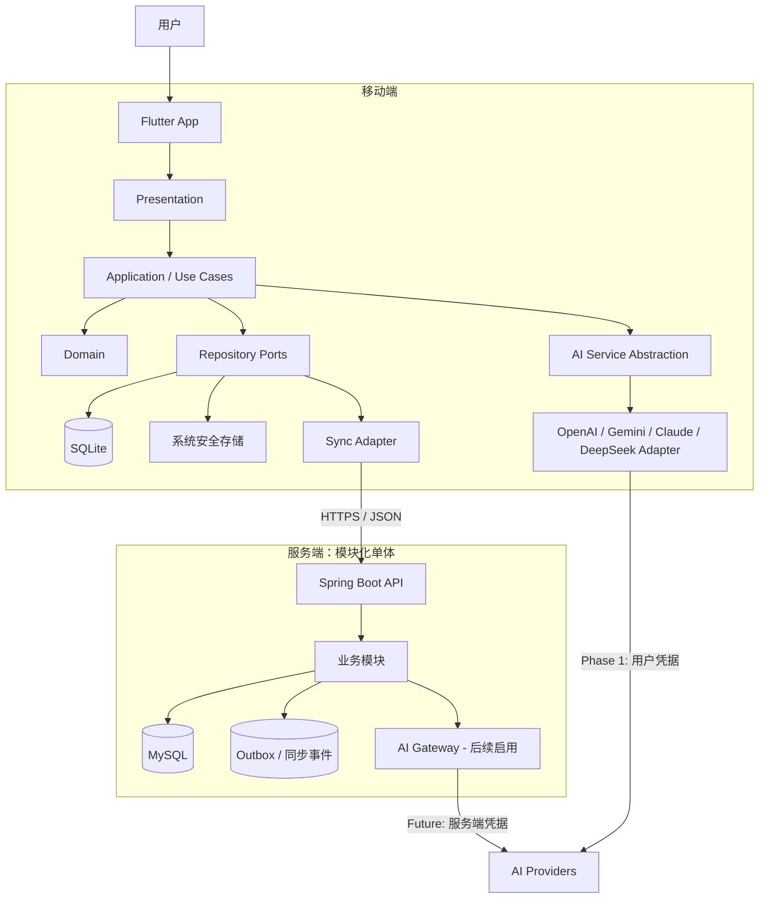
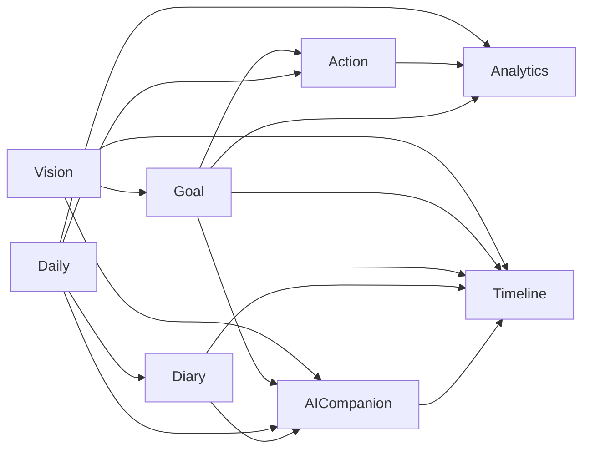
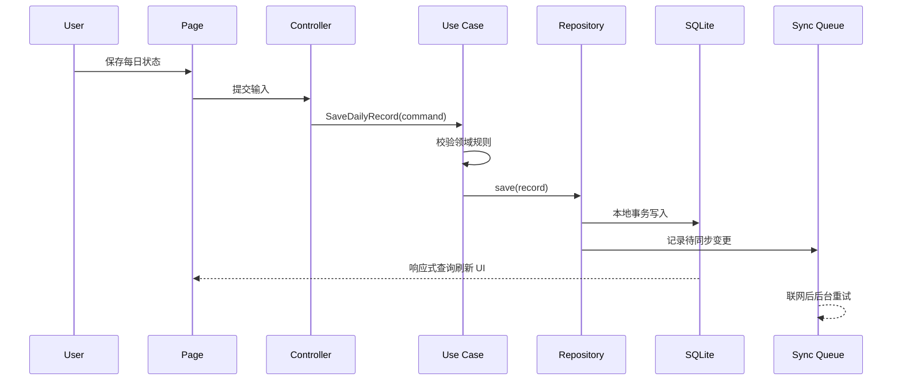

# LifeOS 技术架构设计文档（Architecture）

> “你要怎样度过这一生？”

| 属性 | 内容 |
| --- | --- |
| 文档版本 | v1.1 |
| 状态 | Draft |
| 最后更新 | 2026-07-29 |
| 适用范围 | LifeOS 移动端、服务端、数据与 AI 能力 |
| 关联文档 | `docs/LifeOS_PRD_v1.0.md` |

## 1. 文档目的

本文档定义 LifeOS 的总体技术架构、模块边界、数据流、关键技术决策与分阶段演进路线，作为后续详细设计、编码、测试和评审的共同基线。

当前阶段只确定架构，不创建 Flutter 或 Spring Boot 工程，不实现业务代码。

## 2. 架构目标与约束

### 2.1 架构目标

1. **每天可用**：核心记录能力离线可用，弱网或服务端不可用时不阻塞用户记录。
2. **长期可信**：用户数据可追溯、可迁移、可备份，避免因升级或同步造成数据丢失。
3. **温暖克制**：技术服务于陪伴体验，不使用强制打卡、焦虑排行或过度提醒。
4. **模块清晰**：业务模块高内聚、低耦合，可按阶段独立开发和测试。
5. **AI 可替换**：业务层不依赖具体模型厂商，支持 OpenAI、Gemini、Claude、DeepSeek 及未来服务端代理。
6. **渐进演进**：先完成个人可用的本地版本，再增加账户、同步、云端 AI 和多设备能力。
7. **生产可维护**：统一异常、日志、配置、测试、数据库迁移和可观测性规范。

### 2.2 技术约束

- 移动端：Flutter + Dart
- 首发平台：Android；首个真机验证基线为 vivo X100s
- 服务端：Spring Boot 3，建议使用当前受支持的 Java LTS 版本
- 云端数据库：MySQL 8.x
- 本地数据库：SQLite
- 通信协议：HTTPS + JSON REST API；暂不引入 GraphQL
- 客户端状态：离线优先，以本地数据库作为 UI 的即时数据源
- 第一阶段身份模式：免登录、单用户、本地数据闭环
- 第一阶段 AI 凭据：用户本地配置，并保存到系统安全存储

### 2.3 非目标

首期不设计或实现以下能力：

- 社交、排行榜、社区与支付
- 微服务拆分
- 实时协同编辑
- 复杂工作流引擎
- 自建模型训练或向量数据库
- 游戏化角色系统（仅保留未来演进空间，不提前建表）

## 3. 关键架构决策

| 决策 | 选择 | 原因 |
| --- | --- | --- |
| 客户端数据策略 | Offline-first | 每日记录不能依赖网络，降低打开与记录成本 |
| 服务端形态 | 模块化单体 | 当前规模下比微服务更易开发、部署和保证事务一致性 |
| 移动端组织方式 | Feature-first + 分层 | 功能边界直观，避免全局 `pages/services/models` 随项目增长失控 |
| 状态管理 | Riverpod（正式建项前确认版本） | 依赖注入、异步状态和可测试性较好，减少对 `BuildContext` 的耦合 |
| Flutter 路由 | go_router（正式建项前确认版本） | 支持声明式路由、鉴权重定向和深链 |
| SQLite 访问 | Drift（正式建项前确认版本） | 类型安全、迁移明确、便于响应式查询与测试 |
| 服务端数据访问 | Spring Data JPA + 必要的原生查询 | 常规领域开发效率高；统计场景允许按需优化，避免过早复杂化 |
| 数据库迁移 | Flyway | 迁移版本可审计，适合持续交付 |
| 实体标识 | UUID/ULID 字符串标识 | 支持离线创建，避免客户端与服务端自增 ID 冲突 |
| 时间存储 | UTC；界面按用户时区展示 | 避免跨时区与夏令时问题 |
| 删除策略 | 业务软删除 + 定期清理 | 支持同步、误删恢复和审计 |
| API 风格 | 版本化 REST `/api/v1` | 简单、成熟、便于移动端调试和演进 |
| AI 集成 | 端口/适配器模式 | 隔离供应商 SDK、请求格式、错误和流式协议 |

以上第三方库的具体版本在创建工程时依据官方稳定版、Flutter/Spring Boot 兼容矩阵和维护状态锁定，不在架构文档中写死。

## 4. 总体架构



### 4.1 分阶段运行模式

#### Phase 1：本地优先个人版

- 仅发布 Android 版本，并以 vivo X100s 进行首轮真机兼容性验证。
- Vision、Goal、Daily、Action、Diary 等核心数据保存在 SQLite。
- Diary 图片进入 MVP：图片文件保存在应用私有目录，SQLite 只保存附件元数据与本地引用。
- UI 只从本地仓储读取，保存操作立即落地本地。
- 首期免登录，不因账户或后端状态阻塞个人使用。
- AI Provider 由用户配置，API Key 仅保存在 Android Keystore 封装的安全存储中。
- 后端可独立搭建和验证，但不作为每日记录的强依赖。

#### Phase 2：账户与云同步

- 引入注册、登录、令牌刷新和设备管理。
- 本地变更通过同步队列增量上传，服务端变更按游标增量下发。
- 服务端 MySQL 成为跨设备数据的权威副本；单设备交互仍以 SQLite 为即时数据源。

#### Phase 3：服务端统一 AI

- 移动端 `AiService` 接口保持不变，仅将实现从本地 Provider Adapter 切换到 Remote AI Adapter。
- Provider Key 转移到服务端密钥管理系统，客户端不再持有平台级密钥。
- 服务端统一实现限流、用量、模型路由、审计与内容安全策略。

## 5. 领域与模块划分

### 5.1 领域关系



### 5.2 模块职责

| 模块 | 核心职责 | 主要边界 |
| --- | --- | --- |
| Identity | 注册、登录、令牌、用户与设备 | Phase 2 启用；不承载个人成长业务 |
| Vision | 长期愿景的创建、编辑、归档 | 描述方向，不承担任务调度 |
| Goal | 90 天目标、周期、状态和进度 | 目标进度由明确规则计算，不由 AI 直接改写 |
| Daily | 睡眠、情绪、精力、体重等每日状态 | 按用户本地日期唯一，保留原始记录 |
| Action | 每日行动、最低行动、完成状态 | 与普通 Todo 区分，强调目标关联与连续行动 |
| Diary | Markdown 日记、标签与图片附件 | Markdown 原文为事实源；图片进入 MVP，但二进制文件不写入 SQLite |
| AI Companion | Coach、Friend、Analyst 场景编排 | AI 输出是建议或洞察，不能无确认修改用户事实数据 |
| Timeline | 聚合重要人生节点 | 支持手动事件与系统事件，系统事件需可追溯来源 |
| Analytics | 趋势、完成率、周期汇总 | 优先确定性计算；AI 只解释结果，不替代统计逻辑 |
| Sync | 增量上传、下载、冲突处理与重试 | 不包含业务规则，通过模块仓储端口访问数据 |
| Shared Kernel | ID、时间、分页、错误模型等 | 仅放稳定通用能力，禁止演变成业务杂物箱 |

### 5.3 AI Companion 场景边界

- **AI Coach**：围绕目标与行动给出可执行建议，语气不批判，不制造负罪感。
- **AI Friend**：以倾听和情绪支持为主，不伪装真人，不替代医疗或心理专业服务。
- **AI Analyst**：基于授权范围内的结构化数据生成周报、月报和趋势解释。
- 三种角色共享底层 AI 能力，但使用独立的场景策略、提示词模板和输出结构。
- 高风险内容（自伤、医疗、财务等）必须有安全提示和预设降级响应；详细策略在 AI 模块设计阶段补充。

## 6. 移动端架构

### 6.1 分层约束

```text
presentation  -> application -> domain
data          -> domain
infrastructure-> application/domain ports
```

- `presentation`：页面、组件、路由和 UI 状态，不直接访问数据库或 HTTP。
- `application`：用例编排、事务边界、DTO 映射，不包含平台 UI 逻辑。
- `domain`：实体、值对象、领域规则和仓储接口，不依赖 Flutter、SQLite 或供应商 SDK。
- `data`：仓储实现、本地/远程数据源、持久化模型与映射。
- `infrastructure`：网络、日志、安全存储、AI Provider、通知等技术适配器。

禁止页面直接调用 DAO、HTTP Client 或 AI SDK。所有业务操作必须经过用例或应用服务。

### 6.2 建议目录结构

```text
mobile/
├─ lib/
│  ├─ app/
│  │  ├─ app.dart
│  │  ├─ bootstrap.dart
│  │  ├─ router/
│  │  └─ theme/
│  ├─ core/
│  │  ├─ config/
│  │  ├─ database/
│  │  ├─ error/
│  │  ├─ logging/
│  │  ├─ network/
│  │  ├─ security/
│  │  └─ ui/
│  ├─ features/
│  │  ├─ vision/
│  │  ├─ goal/
│  │  ├─ daily/
│  │  ├─ action/
│  │  ├─ diary/
│  │  ├─ ai_companion/
│  │  ├─ timeline/
│  │  ├─ analytics/
│  │  └─ settings/
│  └─ main.dart
├─ test/
├─ integration_test/
└─ pubspec.yaml
```

每个 `features/<feature>` 内部按实际需要建立 `presentation/application/domain/data`，小模块不创建空目录。

### 6.3 客户端数据流



保存成功的用户反馈以本地事务提交为准，不等待网络请求完成。

### 6.4 UI 与设计系统原则

- 启动页核心文案为“你要怎样度过这一生？”，支持无障碍字体缩放和深色模式。
- 首页优先展示“今天”，避免信息密度过高。
- 情绪和完成状态使用文字、图标与颜色共同表达，不能只依赖颜色。
- 动画服务于状态反馈，尊重系统“减少动态效果”设置。
- 设计 Token 统一管理颜色、字体、圆角、间距和阴影，业务页面禁止散落硬编码样式。
- 提醒默认克制、可关闭；不使用羞辱、威胁或制造连续打卡焦虑的文案。

### 6.5 Android 首发约束

- 首轮真机覆盖 vivo X100s，并额外使用至少一个标准 Android 模拟器验证系统兼容性。
- 通知与后台任务需要单独验证 vivo 系统的权限、节电和后台限制，不能只以模拟器结果作为验收依据。
- 首期不建立 iOS 构建与发布流水线，但业务层和数据层避免引入无必要的 Android 专属依赖。
- Android 最低与目标 SDK 在工程初始化时依据 Flutter 稳定版、插件兼容性和目标设备系统版本形成 ADR。

## 7. 服务端架构

### 7.1 模块化单体

服务端使用单一可部署应用，业务在代码层保持明确模块边界。模块之间优先通过公开应用服务或领域事件协作，禁止跨模块直接访问内部 Repository 或数据表。

### 7.2 建议目录结构

```text
server/
├─ src/main/java/<base-package>/lifeos/
│  ├─ LifeOsApplication.java
│  ├─ shared/
│  │  ├─ config/
│  │  ├─ error/
│  │  ├─ logging/
│  │  ├─ security/
│  │  └─ web/
│  ├─ identity/
│  ├─ vision/
│  ├─ goal/
│  ├─ daily/
│  ├─ action/
│  ├─ diary/
│  ├─ companion/
│  ├─ timeline/
│  ├─ analytics/
│  └─ sync/
├─ src/main/resources/
│  ├─ db/migration/
│  ├─ application.yml
│  ├─ application-local.yml
│  └─ application-prod.yml
└─ src/test/
```

模块内部建议结构：

```text
<module>/
├─ api/             # Controller、请求与响应 DTO
├─ application/     # 用例、命令、查询、事务编排
├─ domain/          # 聚合、值对象、领域服务、端口
└─ infrastructure/  # JPA、外部服务与适配器
```

### 7.3 API 规范

- 基础路径：`/api/v1`
- 资源使用复数名词，例如 `/api/v1/goals`。
- JSON 字段采用 `camelCase`，枚举传输值保持稳定并文档化。
- 时间点使用 ISO 8601 UTC，例如 `2026-07-29T01:30:00Z`。
- 用户语义日期使用 ISO 8601 日期，例如 `2026-07-29`，并保留记录时区。
- 列表接口使用游标分页；后台管理类简单列表可使用页码分页。
- 写接口支持 `Idempotency-Key` 或实体版本，防止重试导致重复数据。
- 使用 OpenAPI 生成并校验接口契约，但生成代码不能替代领域模型。

统一错误响应示例：

```json
{
  "code": "GOAL_NOT_FOUND",
  "message": "目标不存在或已被删除",
  "requestId": "01J...",
  "details": []
}
```

- `code`：供客户端稳定判断，不能直接使用异常类名。
- `message`：安全、可展示的默认信息，可按语言本地化。
- `requestId`：用于跨端定位日志。
- 服务端不得向客户端返回堆栈、SQL、密钥或内部网络信息。

### 7.4 认证与授权演进

- Phase 1 本地模式不强制登录。
- Phase 2 使用短期 Access Token + 可轮换 Refresh Token。
- Refresh Token 按设备保存摘要并支持服务端撤销；客户端保存于系统安全存储。
- 所有用户数据查询必须显式带 `userId` 数据边界，不能只依赖前端传参。
- 敏感操作支持重新认证，账户注销触发可审计的数据删除流程。

## 8. 数据架构

### 8.1 核心实体初稿

| 实体 | 关键字段 | 说明 |
| --- | --- | --- |
| User | id, email, status, timezone | Phase 2 启用；邮箱规范化并唯一 |
| Vision | id, userId, title, content, status | 长期愿景，可归档 |
| Goal | id, userId, visionId, title, startDate, endDate, status | 默认支持 90 天周期，不把周期写死在表结构 |
| DailyRecord | id, userId, localDate, timezone, sleepMinutes, mood, energy, weight | 同一用户同一本地日期唯一 |
| DailyAction | id, userId, goalId, localDate, title, minimumAction, status | 状态支持未完成、部分完成、完成 |
| DiaryEntry | id, userId, localDate, markdown, summary | Markdown 原文为主要内容 |
| DiaryTag | diaryId, tagId | 多对多标签关系 |
| Attachment | id, ownerType, ownerId, localPath, storageKey, mediaType, size, checksum | Diary 图片进入 MVP；首期使用本地引用，云同步后增加远程存储 key |
| TimelineEvent | id, userId, occurredAt, type, title, sourceType, sourceId | 手动或系统生成，来源可追溯 |
| AiConversation | id, userId, persona, title | 会话元数据 |
| AiMessage | id, conversationId, role, content, modelInfo | 不保存密钥；模型信息用于可追溯 |
| AiInsight | id, userId, type, periodStart, periodEnd, content, evidenceRefs | AI 洞察必须记录依据范围 |
| SyncChange | id, entityType, entityId, operation, version, syncStatus | 客户端同步队列或服务端变更日志 |

字段将在各模块详细设计阶段确认；当前表格不是最终数据库 DDL。

### 8.2 通用数据字段

需要同步的业务实体统一考虑：

- `id`：客户端可生成的全局唯一标识
- `createdAt`、`updatedAt`：UTC 时间点
- `version`：乐观锁或同步版本
- `deletedAt`：软删除时间
- `deviceId`：必要时记录最后变更设备，不作为授权依据

### 8.3 数据精度与校验

- 睡眠以分钟存储，避免浮点小时误差。
- 体重使用定点小数，并记录单位或统一换算为 kg。
- 情绪、精力使用有限等级值；显示文案与存储枚举解耦。
- `DailyRecord` 使用 `localDate + timezone` 表达“用户的这一天”，不能仅由 UTC 截断推导。
- Goal 的 90 天是产品默认规则，不是数据库硬约束，以便未来支持自定义周期。

### 8.4 SQLite 与 MySQL 一致性

- 领域 ID、枚举传输值、时间语义和字段可空性在两端保持一致。
- SQLite schema 与 MySQL schema 分别迁移，不共享 DDL 文件。
- 客户端数据库迁移必须包含升级测试；生产环境禁止破坏性重建数据库。
- 服务端所有 schema 变化通过 Flyway，禁止手工修改生产表结构。

### 8.5 Diary 图片存储

- 原图和缩略图保存在 Android 应用私有目录，不以 BLOB 形式写入 SQLite，避免数据库膨胀和迁移困难。
- SQLite 保存附件 ID、本地相对路径、媒体类型、文件大小、尺寸、校验值、创建时间和删除状态。
- 导入图片时校验真实媒体类型与大小，并按明确策略处理 EXIF 定位等隐私元数据。
- 日记删除与附件清理采用可恢复的两阶段策略，避免事务中断产生孤儿文件或误删共享文件。
- Phase 1 只保证本机文件生命周期；进入云同步阶段后再引入对象存储、上传状态、远程 key 和缩略图同步。
- 数据导出必须同时包含 Markdown、附件和可验证的清单，防止长期记录被锁定在应用内部。

## 9. 同步架构

### 9.1 同步原则

1. 本地先写，后台同步。
2. 每次同步可重试、可幂等、可断点续传。
3. 删除也作为变更同步，不能直接物理删除。
4. 冲突不能静默覆盖用户长文本。
5. 同步失败不影响用户继续记录，并提供可理解的状态提示。

### 9.2 建议协议

- 客户端为每次本地变更写入 `SyncChange`。
- Push：按顺序批量上传变更，携带实体版本和幂等键。
- Pull：使用服务端游标拉取当前用户在游标之后的变更。
- ACK：服务端确认后更新本地同步状态和服务端版本。
- 重试：指数退避并加入随机抖动；永久错误进入待处理状态，不无限高频重试。

### 9.3 冲突策略

| 数据类型 | 默认策略 |
| --- | --- |
| 每日数值状态 | 字段级合并；无法判断时保留双方版本并提示用户 |
| Action 完成状态 | 比较实体版本与业务时间，保留明确的最新用户操作 |
| Diary/Vision 长文本 | 不自动覆盖，创建冲突副本供用户选择或合并 |
| Timeline 系统事件 | 以 `sourceType + sourceId + eventType` 保证幂等 |
| AI 生成内容 | 视为不可变结果；重新生成创建新版本 |

同步属于 Phase 2，但 Phase 1 的实体标识、版本和删除语义必须兼容上述方案。

## 10. AI Service 抽象设计

### 10.1 设计目标

- 业务用例只表达“需要何种 AI 能力”，不感知厂商 SDK。
- 不同 Provider 的消息格式、流式响应、模型名、错误码和限流差异由适配器处理。
- 支持本地直连与未来服务端代理无缝切换。
- AI 失败时核心记录功能仍可使用。

### 10.2 逻辑接口

```text
AiService
├─ complete(AiRequest) -> AiResponse
├─ stream(AiRequest) -> Stream<AiChunk>
└─ validateConfiguration() -> ProviderStatus

AiProviderAdapter
├─ OpenAiAdapter
├─ GeminiAdapter
├─ ClaudeAdapter
├─ DeepSeekAdapter
└─ RemoteAiAdapter      # 未来服务端统一调用

CompanionScenario
├─ CoachScenario
├─ FriendScenario
└─ AnalystScenario
```

建议请求模型包含：

- 场景类型与提示词模板版本
- 结构化上下文，而非拼接后的任意字符串
- 用户语言、时区和允许使用的数据范围
- 温度、最大输出等与厂商无关的通用选项
- 是否要求结构化输出与对应 schema

响应模型建议包含：

- 文本或结构化结果
- Provider、模型和调用耗时
- Token/用量信息（供应商提供时）
- 请求追踪 ID、完成原因和安全状态
- 可重试错误的统一分类

### 10.3 Provider 配置

- API Key 通过安全存储接口读写，不进入 SQLite、SharedPreferences、源码、Git、崩溃报告或日志。
- 设置页仅显示掩码，不提供完整密钥回显。
- 可配置 Provider、模型和可选 Base URL；自定义地址必须明确提示隐私风险。
- 日志拦截器必须对 `Authorization`、`x-api-key`、请求正文中的敏感字段进行脱敏。
- 本地直连模式无法完全隐藏用户自己的 Key，应在设置页明确风险和计费归属。

### 10.4 AI 上下文与隐私

- 默认最小化上下文，只发送完成当前场景所需的数据；“最小化”不等于 AI 只能分析当天。
- 睡眠、情绪、精力、体重、行动完成率等历史趋势先在本地进行确定性计算，AI 默认接收指定周期的聚合指标和趋势摘要，而不是全部原始记录。
- 用户发起周报、月报或阶段复盘时，可以选择时间范围与数据类型，并在发送前看到本次上下文范围。
- 历史日记原文和图片属于高敏感内容，不随聚合统计默认发送；只有用户明确选择后才进入某次 AI 请求。
- 在发送日记、情绪等敏感内容前清楚说明，并允许用户关闭某类数据授权。
- AI 输出不作为事实数据直接写入 Daily、Goal 或 Diary；需要用户确认后才能转为行动或记录。
- Prompt 模板需版本化，以便复现结果和回归测试。
- 长期记忆后续单独设计，首期不把所有历史记录无差别发送给模型。

### 10.5 错误归一化

Provider Adapter 将厂商错误映射为统一类型：

- `invalidCredential`
- `rateLimited`
- `quotaExceeded`
- `contentRejected`
- `contextTooLong`
- `networkUnavailable`
- `providerUnavailable`
- `invalidResponse`
- `unknown`

只有安全且可操作的信息展示给用户；原始响应需脱敏后才能进入调试日志。

## 11. 安全与隐私

### 11.1 数据分级

| 级别 | 示例 | 处理要求 |
| --- | --- | --- |
| 高敏感 | API Key、Refresh Token、密码凭据 | 仅安全存储/服务端密钥系统，禁止日志与明文备份 |
| 敏感 | 日记、情绪、健康数据、AI 对话 | 加密传输、严格授权、最小化采集、可导出删除 |
| 内部 | 请求 ID、设备与同步元数据 | 限制用途和保留周期 |
| 公开 | 产品文案、公开帮助内容 | 常规完整性保护 |

### 11.2 安全基线

- 所有网络通信使用 HTTPS，生产环境禁止明文 HTTP。
- 密码由服务端使用成熟自适应算法散列；不自行实现密码学。
- 配置按环境分离，示例配置不包含真实凭据。
- 依赖持续进行漏洞检查，发布前审查高危漏洞。
- Markdown 渲染禁用危险 HTML 或进行严格清洗，防止脚本与恶意链接。
- 文件上传验证大小、媒体类型、扩展名和实际内容；对象存储使用不可猜测 key。
- 提供数据导出、账户注销与删除路径，具体保留期限在隐私设计阶段确认。
- 移动端本地数据库加密是否首期启用，在 Stage 0 通过威胁建模、性能和插件兼容性验证形成 ADR；在决策前不得宣称“本地数据已加密”。
- 无论数据库是否加密，API Key 始终使用 Android Keystore 封装的安全存储，不能因单用户模式降低凭据保护级别。
- 在明确数据库与附件备份的加密策略前，禁止将日记数据库和图片无提示地纳入厂商云备份。

## 12. 异常处理与日志规范

### 12.1 异常处理

- 领域层返回明确业务错误，不抛出带基础设施细节的异常给 UI。
- 移动端统一将错误映射为用户可理解状态、可重试操作和诊断信息。
- 服务端使用全局异常处理器转换为稳定错误码和正确 HTTP 状态。
- 可恢复错误与程序缺陷分开统计，禁止用 `catch (Exception)` 静默吞错。
- AI、同步和统计属于可降级能力，不应导致 Daily 等核心记录入口崩溃。

### 12.2 日志规范

- 使用结构化日志，至少包含时间、级别、环境、服务、requestId 和事件名。
- 移动端日志分开发/生产级别；生产不输出数据库内容、日记、Token、Key 或完整 AI Prompt。
- 服务端通过 MDC 贯穿 requestId；跨服务/Provider 调用透传可控的追踪标识。
- 日志消息描述事件而不是堆砌对象，禁止打印整个请求或实体。
- 安全事件、业务审计日志与普通应用日志分开管理。

## 13. 可观测性与运行保障

服务端进入可部署阶段后至少提供：

- 健康检查：存活、就绪、数据库连接
- 指标：请求量、错误率、延迟、连接池、同步失败、AI 调用失败与耗时
- 链路：requestId；规模增长后再评估 OpenTelemetry
- 告警：高错误率、数据库不可用、同步积压、AI Provider 持续失败
- 备份：MySQL 自动备份与恢复演练；只有备份成功但未验证恢复不算完成

移动端关注：

- 崩溃率与无响应
- 启动耗时、首页可交互耗时
- 数据库迁移失败率
- 同步成功率与积压时间
- 监控数据不得包含用户日记、健康明细或 AI 对话正文

## 14. 测试策略

### 14.1 测试金字塔

| 层级 | 移动端 | 服务端 |
| --- | --- | --- |
| 单元测试 | 领域规则、Use Case、状态控制器、映射器 | 领域模型、应用服务、校验与映射 |
| 组件/切片测试 | Widget、数据库 DAO、Provider Adapter | Controller、Repository、Security Slice |
| 集成测试 | SQLite 迁移、离线流程、Mock HTTP | MySQL/Testcontainers、Flyway、完整 API |
| 端到端测试 | 启动、每日记录、任务、日记、AI 降级 | 注册/同步/权限等关键链路 |
| 契约测试 | 客户端与 OpenAPI 契约 | API 兼容性、AI Adapter 固定样例 |

### 14.2 关键质量门槛

- 新增领域规则必须有单元测试。
- 每次 SQLite/Flyway 迁移必须有从上一版本升级的测试。
- AI 测试默认使用 Fake Adapter 或录制后脱敏的固定样例，CI 不调用真实收费接口。
- 核心流程包含异常与离线场景，不只测试成功路径。
- 覆盖率作为风险信号，不设置鼓励无意义测试的单一数字目标；核心领域分支必须覆盖。

## 15. 配置与环境

建议环境：`local`、`test`、`staging`、`production`。

- 代码仓库只提交 `.env.example` 或示例 YAML，不提交真实凭据。
- Flutter 使用编译环境配置与运行时安全配置分离；API Key 属于用户运行时安全配置。
- Spring Boot 生产密钥从环境变量或密钥服务注入，配置文件只保存非敏感默认值。
- 开发、测试和生产数据库完全隔离。
- 默认日志和调试开关在生产环境关闭。

## 16. CI/CD 与 Git 规范

### 16.1 分支与提交

- 默认分支：`main`，始终保持可构建。
- 功能开发使用短生命周期分支，例如 `feature/daily-record`。
- 提交建议遵循 Conventional Commits，例如：
  - `docs: add initial technical architecture`
  - `feat(daily): add local daily record flow`
  - `fix(sync): prevent duplicate change upload`
- 每个模块完成后执行状态检查、测试、提交和推送；推送失败需保留本地提交并报告原因。

### 16.2 CI 质量门禁

移动端：

- 格式检查
- 静态分析
- 单元与 Widget 测试
- Debug 构建

服务端：

- 编译与格式/静态检查
- 单元、切片与集成测试
- Flyway 迁移验证
- 依赖漏洞扫描
- 容器镜像构建（进入部署阶段后）

项目仅使用 GitHub，默认远程名为 `origin`，CI 使用 GitHub Actions。构建与测试逻辑仍封装为本地可执行的项目命令，避免流水线逻辑只能在 GitHub 环境运行。

## 17. 分阶段开发计划

每个阶段均按“设计说明 → 实现 → 测试 → 问题检查 → Git 提交与推送 → 汇报”闭环执行。

### Stage 0：工程基线

- 建立 Flutter 与 Spring Boot 工程骨架
- 建立 Android 构建基线并验证 vivo X100s 真机运行
- 统一格式、静态检查、测试与环境配置
- 建立错误、日志、主题和数据库迁移基线
- 完成本地数据库、Diary 图片和备份策略的安全 ADR
- 配置 GitHub `origin` 远程与 GitHub Actions

### Stage 1：本地每日闭环

- Daily 状态记录
- Daily Action 与最低行动
- 本地 SQLite、离线流程和首页体验

选择 Daily 作为首个业务模块，是因为它最直接验证“用户每天愿意打开”的核心目标。

### Stage 2：方向与记录

- Vision
- 90 天 Goal
- Markdown Diary 与本地图片附件
- Goal、Action 与每日记录的关联

### Stage 3：AI Companion MVP

- AI Service 抽象
- OpenAI、Gemini、Claude、DeepSeek Adapter
- 本地安全配置 API Key
- AI 每日总结，先落地 Coach/Analyst 的有限场景
- Friend 安全边界与陪伴场景

### Stage 4：回顾与洞察

- Timeline
- 确定性统计与趋势
- 基于用户选择范围和本地历史聚合的 AI 周报/月报解释

### Stage 5：账户与同步

- Identity
- 增量同步、冲突处理和数据恢复
- 多设备与云备份

### Stage 6：云端 AI 与产品化

- Remote AI Adapter 与服务端 AI Gateway
- 限流、配额、用量与安全治理
- 发布、监控、隐私合规和恢复演练

## 18. 架构风险与应对

| 风险 | 影响 | 应对 |
| --- | --- | --- |
| 本地与云端数据模型过早分叉 | 同步成本和数据丢失风险 | 从首期统一 ID、时间、枚举、版本与删除语义 |
| API Key 存储或日志泄漏 | 费用与隐私风险 | 系统安全存储、全链路脱敏、禁止 Key 入库入 Git |
| AI 建议被误当事实 | 用户信任受损 | AI 内容独立存储、标注来源、修改事实前由用户确认 |
| 过度设计导致首版迟迟不可用 | 无法验证每日价值 | 模块化单体、本地闭环优先、延后微服务与复杂记忆 |
| 日记/健康数据隐私泄漏 | 严重信任与合规风险 | 最小采集、授权发送、加密传输、导出删除与审计 |
| 离线冲突静默覆盖 | 长期记录丢失 | 长文本保留冲突副本，明确版本与可恢复机制 |
| 统计口径频繁变化 | 趋势失真 | 指标定义版本化，确定性计算与 AI 解释分离 |
| Flutter/Spring 依赖升级破坏兼容 | 维护成本上升 | 锁定版本、自动化测试、定期小步升级 |

## 19. 已确认事项与遗留决策

### 19.1 已确认事项

| 事项 | 决策 |
| --- | --- |
| 首发平台 | Android 单平台；首个个人设备与真机基线为 vivo X100s |
| Phase 1 身份模式 | 免登录，先完成本地每日闭环，后期随账户与同步功能引入登录 |
| Diary 图片 | 进入 MVP；首期保存在应用私有目录，SQLite 管理附件元数据 |
| AI 历史分析 | 支持历史；默认发送本地聚合结果，用户按时间范围与数据类型授权更多上下文 |
| 历史日记授权 | 原文与图片不默认发送，必须由用户明确选择 |
| Goal 周期 | 90 天作为默认模板，不作为数据库硬限制 |
| Git 远程 | 仅使用 GitHub，仓库为 `Adgaiz/LifeOS`，默认远程名为 `origin` |

“单远程”表示本地仓库只向一个托管仓库推送，本项目即 GitHub；“双远程镜像”则表示同一份代码同时推送到 GitHub 和 Gitee。当前项目不需要双远程。

### 19.2 遗留决策

本地数据库和 Diary 图片是否在 MVP 使用应用层加密仍待确认。建议不要仅凭主观选择：Stage 0 先完成简短威胁建模，并在 vivo X100s 上验证加密方案的性能、数据库迁移、图片访问与备份行为，再记录 ADR。该决策不阻塞工程基线创建，但必须在写入真实个人数据前完成。

## 20. 验收标准

本文档通过评审后，后续工程应满足：

- 任一业务模块能明确归属，且不跨层直接访问基础设施。
- 核心记录断网可创建、读取和修改。
- 替换 AI Provider 不要求修改 Coach、Friend、Analyst 的核心业务逻辑。
- API Key 不进入数据库、日志、源码和版本控制。
- 本地数据模型具备未来增量同步所需的标识、版本和删除语义。
- AI 失败、服务端失败或同步失败不影响核心记录功能。
- 数据库迁移、关键领域规则和核心用户流程均有自动化测试。
- 每阶段可独立构建、验证、提交和回滚。

## 21. 架构结论

LifeOS 采用“**移动端离线优先 + 服务端模块化单体 + AI 端口适配器**”的总体架构。

这套架构首先保障用户随时记录和长期保存人生数据，再逐步增加同步与智能能力。AI 是陪伴和解释层，不是数据事实源；统计规则保持确定性；用户始终拥有对数据、上下文授权和建议采纳的最终控制权。

下一步进入 **Stage 0：工程基线设计与初始化**。本地数据加密作为该阶段首个安全 ADR 处理，后续仍按模块逐步开发，不一次性生成全部代码。
